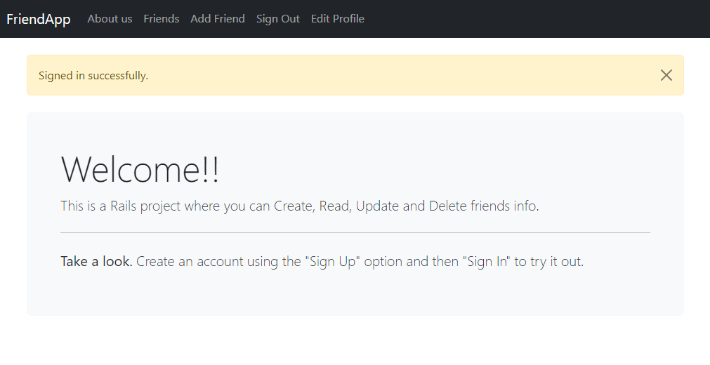
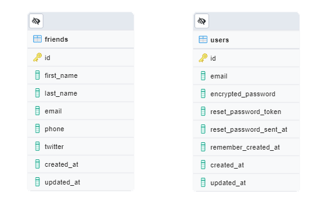
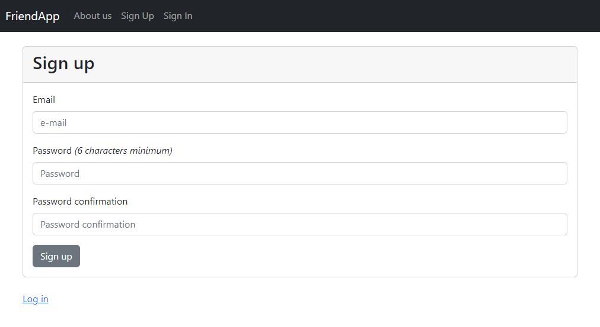
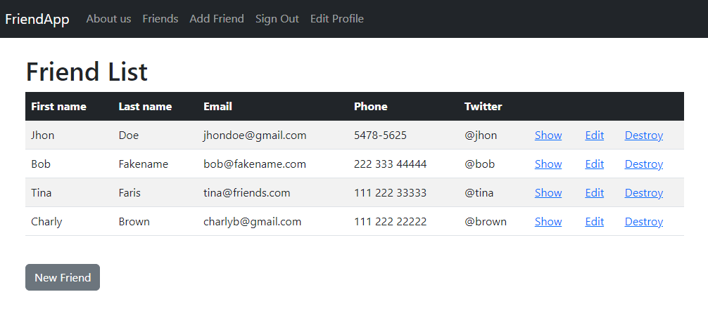
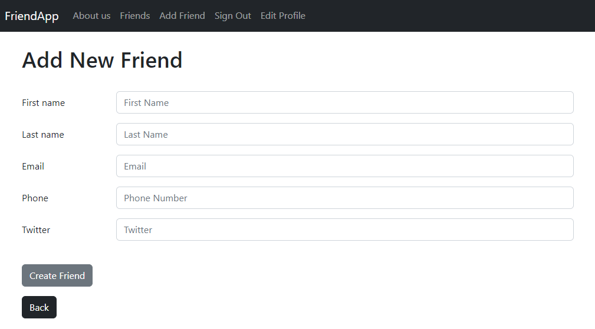
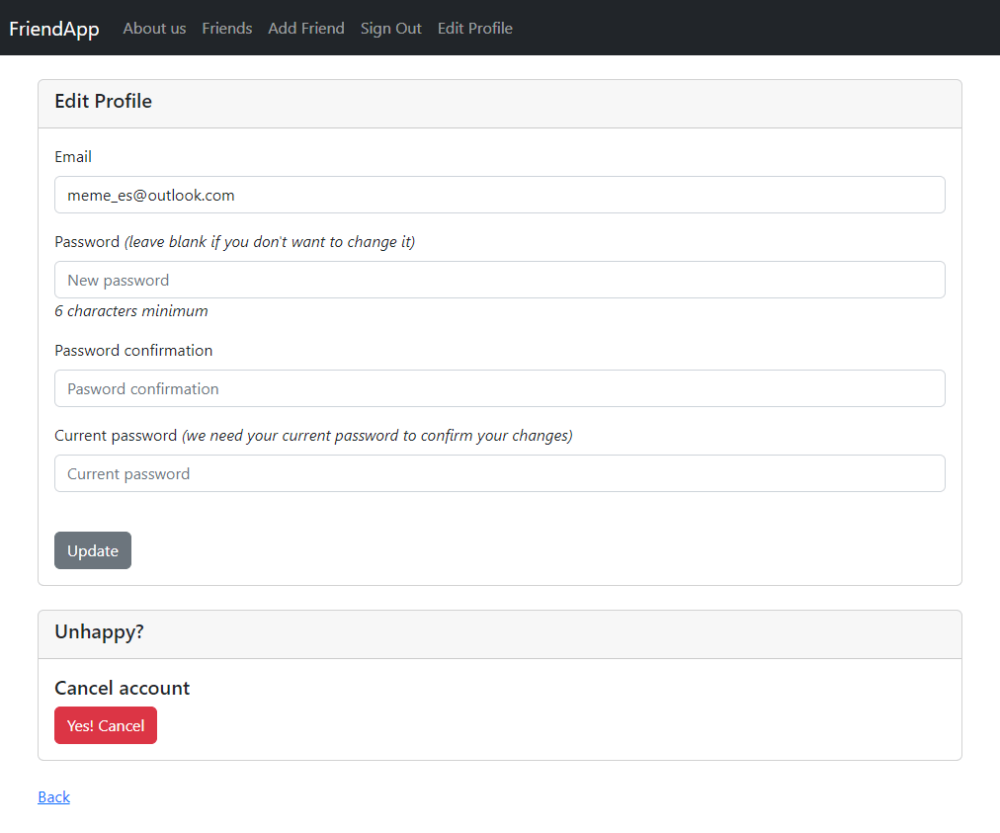

# Ruby FriendsApp

> This is a Rails project where you can Create, Read, Update and Delete friends info.

FriendsApp is a basic web app that uses a sign-up and a login that lets you manage a list of friends through CRUD actions.

The project is build using two models:

## Built With

- Ruby 2.7.6,
- Rails 6.1.6,
- PostgreSQL 13.2.2
- Bootstrap 5.2
- Devise Gem v4.8.1

## Getting Started

**To get a local copy up and running follow these simple next steps.**

### Prerequisites

- Ruby 2.7.6,
- Rails 6.1.6,
- PostgreSQL
- Get a copy using `git clone https://github.com/me-skit/rails_friends.git`

### Setup

**Once you get a copy, run the next instructions inside the project folder.**

- Run `bundle install` in order to get the project gems installed.
- Set up the right user and password for your database in the file `config/database.yml`.
- Run the project migration through `rails db:migrate`.
- Start a local server using `rails server` or the short way `rails s`.
- Open a web browser and check how it works typing `http://127.0.0.1:3000` in the address bar.

### Usage

One of the first things you can do is create an account using the "Sign Up" option in the menu.

After that you will be redirected to the welcome page, once there you can use the menu to show the friend list, add, edit o delete friend info, sign out or edit your profile.

#### Friend List

#### Add or Edit a Friend

#### Edit Your Profile

## Author

👤 **Manuel (Meme)**

- Github: [@me-skit](https://github.com/me-skit)
- Linkedin: [linkedin](https://www.linkedin.com/in/manuel-elias/)

## 🤝 Contributing

Contributions, issues and feature requests are welcome!

Feel free to check the [issues page](https://github.com/me-skit/rails_friends/issues).

## Show your support

Give a ⭐️ if you like this project!

## 📝 License

This project is not licensed.
